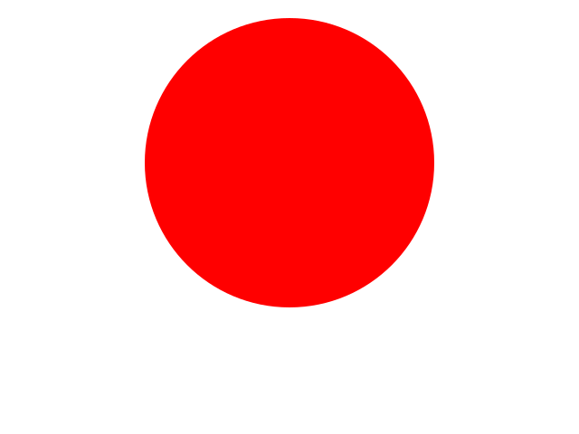
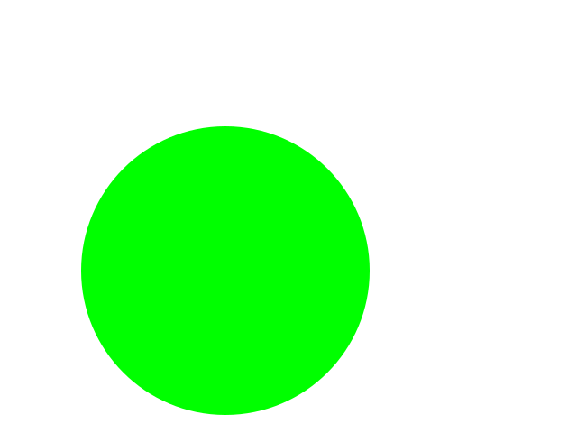
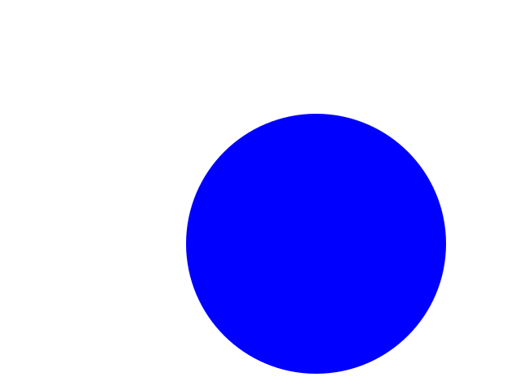
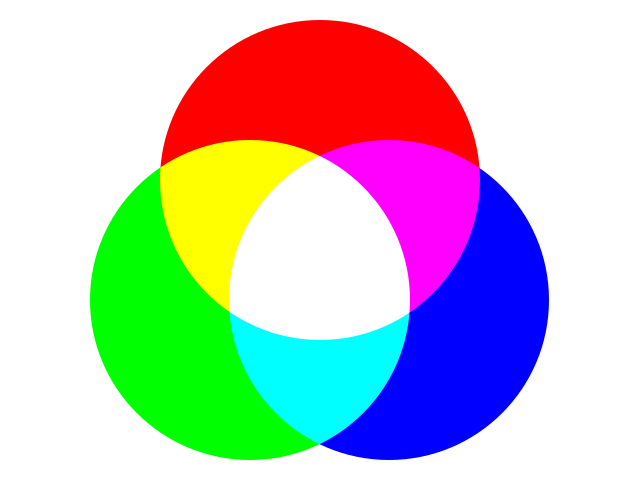

# GLShaderKit_multiTexture.obj

シェーダーで複数のテクスチャを使用するサンプルです。
3枚の画像を加算合成します。

<table>
    <thead>
        <tr><th>テクスチャ0</th><th>テクスチャ1</th></tr>
    </thead>
    <tbody>
        <tr>
            <td>  </td>
            <td>  </td>
        </tr>
    </tbody>
    <thead>
        <tr><th>テクスチャ2</th><th>出力</th></tr>
    </thead>
    <tbody>
        <tr>
            <td>  </td>
            <td>  </td>
        </tr>
    </tbody>
</table>
